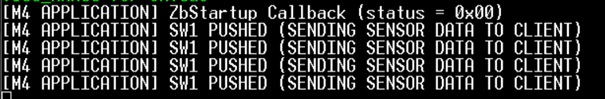
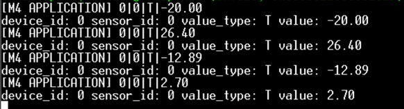

# STM32WB-ZigBee-communication

The Goal of this project is to use a ZigBee communication to pass wirelessly data from sensors to IoT hub. To do this two STM32WB55 boards were used:
- one client board responsible for gathering data
- one server board which collects data from multiple sensors and sends it through ZigBee to client

For a project base, 2 examples provided by STM were used to provide ZigBee communication: Zigbee_SE_Msg_Client_Coord and Zigbee_SE_Msg_Server_Router from
[STM32Cube MCU Package for STM32WB Series](https://www.st.com/en/embedded-software/stm32cubewb.html#get-software). Then examples were modified to meet project needs.

**LIST OF CONTENT:**

- [STM32WB-ZigBee-communication](#stm32wb-zigbee-communication)
  - [Getting Started](#getting-started)
  - [Project Demo](#project-demo)
  - [Useful resources](#useful-resources)
  - [Author](#author)

## Getting Started
To run the projects following steps should be done:

1. Upload "stm32wb5x_Zigbee_FFD_fw.bin" wireless binary into right address for both client and server boards. Instruction for doing this can be found [here](https://github.com/STMicroelectronics/STM32CubeWB/blob/master/Projects/STM32WB_Copro_Wireless_Binaries/STM32WB5x/Release_Notes.html).
2. Connect both boards to PC.
3. Open some serial ports monitor (e.g. putty or Tera Term) to observe messages.
4. Build and run my modified Zigbee_SE_Msg_Client_Coord project on one board.
5. Build and run my modified Zigbee_SE_Msg_Server_Router on second board.
6. Push SW1 button on server board to send sensor data structure through ZigBee message to client board.
7. Sensor data message will be printed by client board.

## Project Demo
In a current version of the project sending sensor data is triggered by button press. After launching the project, following results can be expected:

Pressing SW1 button on server board triggers function which encode sensor data and sends it through ZigBee message to client board.

Client board receives data, decode it and print it to console.

## Useful resources

ZigBee pdf instructions:
* [Zigbee clusters templates on STM32WB Series ](https://www.st.com/resource/en/application_note/an5498-how-to-use-zigbee-clusters-templates-on-stm32wb-series-stmicroelectronics.pdf)

* [Getting started with Zigbee on STM32WB Series ](https://www.st.com/resource/en/application_note/an5506-getting-started-with-zigbee-on-stm32wb-series-stmicroelectronics.pdf)

Download sources:
* [STM32Cube MCU Package for STM32WB Series](https://www.st.com/en/embedded-software/stm32cubewb.html#get-software)

* [STM32 CubeProgrammer software ](https://www.st.com/en/development-tools/stm32cubeprog.html)

* [Wireless Binaries for  STM32WB5x](https://github.com/STMicroelectronics/STM32CubeWB/tree/master/Projects/STM32WB_Copro_Wireless_Binaries/STM32WB5x)

Wireless Binaries installation instruction:
* [Release Notes with Wireless Coprocessor Binary Table](https://github.com/STMicroelectronics/STM32CubeWB/blob/master/Projects/STM32WB_Copro_Wireless_Binaries/STM32WB5x/Release_Notes.html)

## Author

[August Majewski](https://github.com/kolovoz14)
